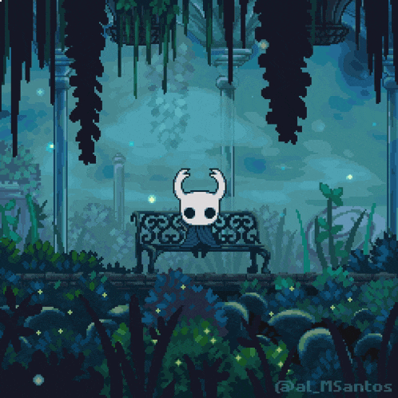

<!-- Profile Banner -->

  

<!-- Typing Intro -->

  

---

## 🖥️ Tech Stack

<table>
  <tr>
    <td align="center" width="50%">
      <h3>⚡ Frontend</h3>
      

        
        
        
        
        
      

    </td>
    <td align="center" width="50%">
      <h3>🛠 Backend</h3>
      

        
        
        
        
        
      

    </td>
  </tr>
</table>

---

## 📊 GitHub Stats

  

---

## 🎧 Listening to

  

